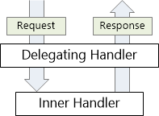
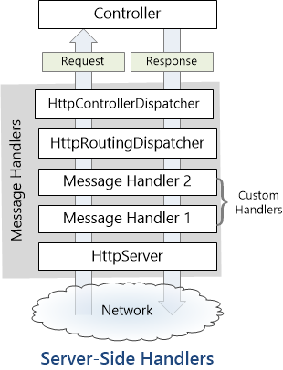

Title: HttpClient to Consume API
Published: 06/13/2019
Tags:
    - C#
    - httpClient
    - Asp.net
---

HttpClient to Comsume API
===========================================

# HttpClient

Provides a base class for sending HTTP requests and receiving HTTP responses


```csharp
// HttpClient is intended to be instantiated once per application, rather than per-use. See Remarks.
static readonly HttpClient client = new HttpClient();
 
static async Task Main()
{
  // Call asynchronous network methods in a try/catch block to handle exceptions
  try	
  {
     HttpResponseMessage response = await client.GetAsync("http://www.contoso.com/");
     response.EnsureSuccessStatusCode();
     string responseBody = await response.Content.ReadAsStringAsync();
     // Above three lines can be replaced with new helper method below
     // string responseBody = await client.GetStringAsync(uri);

     Console.WriteLine(responseBody);
  }  
  catch(HttpRequestException e)
  {
     Console.WriteLine("\nException Caught!");	
     Console.WriteLine("Message :{0} ",e.Message);
  }
}
```

## WebRequest
Makes a request to a Uniform Resource Identifier (URI). This is an abstract class.

Because the WebRequest class is an abstract class, the actual behavior of WebRequest instances at run time is determined by the descendant class (such as HttpWebRequest and FileWebRequest) returned by Create method.

```csharp
            WebRequest request = WebRequest.Create ("http://www.google.com");
            HttpWebResponse response = (HttpWebResponse)request.GetResponse ();
            Stream dataStream = response.GetResponseStream ();
            // Open the stream using a StreamReader for easy access.
            StreamReader reader = new StreamReader (dataStream);
            string responseFromServer = reader.ReadToEnd ();
            Console.WriteLine (responseFromServer);
            reader.Close ();
            dataStream.Close ();
            response.Close ();
```

## HttpWebRequest
Provides an HTTP-specific implementation of the WebRequest class.

```csharp
    HttpWebRequest myReq =
    (HttpWebRequest)WebRequest.Create("http://www.contoso.com/");
```

*for new development HttpClient class is recommended*

## HttpMessageHandler
A base type for HTTP message handlers.
```csharp
public abstract class HttpMessageHandler : IDisposable
```

There are various HTTP message handles that can be used. These include the following.

* DelegatingHandler - A class used to plug a handler into a handler chain.

* HttpMessageHandler - A simple class to derive from that supports the most common requirements for most applications.

* HttpClientHandler - A class that operates at the bottom of the handler chain that actually handles the HTTP transport operations.

* WebRequestHandler - A specialty class that operates at the bottom of the handler chain class that handles HTTP transport operations with options that are specific to the System.Net.HttpWebRequest object.

## HttpClientHandler
The default message handler used by HttpClient in .NET Framework and .NET Core 2.0 and earlier.
```csharp
public class HttpClientHandler : System.Net.Http.HttpMessageHandler
```

```csharp
static async Task Main()
{
   // Create an HttpClientHandler object and set to use default credentials
   HttpClientHandler handler = new HttpClientHandler();
   handler.UseDefaultCredentials = true;

   // Create an HttpClient object
   HttpClient client = new HttpClient(handler);

   // Call asynchronous network methods in a try/catch block to handle exceptions
   try	
   {
      HttpResponseMessage response = await client.GetAsync("http://www.contoso.com/");

      response.EnsureSuccessStatusCode();

      string responseBody = await response.Content.ReadAsStringAsync();
      Console.WriteLine(responseBody);
   }  
   catch(HttpRequestException e)
   {
       Console.WriteLine("\nException Caught!");	
       Console.WriteLine("Message :{0} ",e.Message);
   }

   // Need to call dispose on the HttpClient and HttpClientHandler objects 
   // when done using them, so the app doesn't leak resources
   handler.Dispose(true);
   client.Dispose(true);
}
```

**HttpClientHandler in .NET Core**

Starting with .NET Core 2.1, the System.Net.Http.SocketsHttpHandler class instead of HttpClientHandler provides the implementation used by higher-level HTTP networking APIs.

## WebRequestHandler
Provides desktop-specific features not available to Windows Store apps or other environments.
```
public class WebRequestHandler : System.Net.Http.HttpClientHandler
```

Delegating handler
----------------------

A message handler is a class that receives an HTTP request and returns an HTTP response. Message handlers derive from the abstract HttpMessageHandler class.

Typically, a series of message handlers are chained together. The first handler receives an HTTP request, does some processing, and gives the request to the next handler. At some point, the response is created and goes back up the chain. This pattern is called a delegating handler.



**Server-Side Message Handlers in Web API**

On the server side, the Web API pipeline uses some built-in message handlers:

* HttpServer gets the request from the host.
* HttpRoutingDispatcher dispatches the request based on the route.
* HttpControllerDispatcher sends the request to a Web API controller.



**Client-Side Message Handlers**

On the client side, the HttpClient class uses a message handler to process requests. The default handler is HttpClientHandler, which sends the request over the network and gets the response from the server. You can insert custom message handlers into the client pipeline:


**Custom Message Handlers**
To write a custom message handler, derive from System.Net.Http.DelegatingHandler and override the SendAsync method. Here is the method signature:
```csharp
Task<HttpResponseMessage> SendAsync(
    HttpRequestMessage request, CancellationToken cancellationToken);
```

